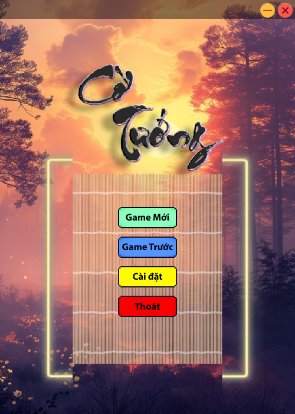
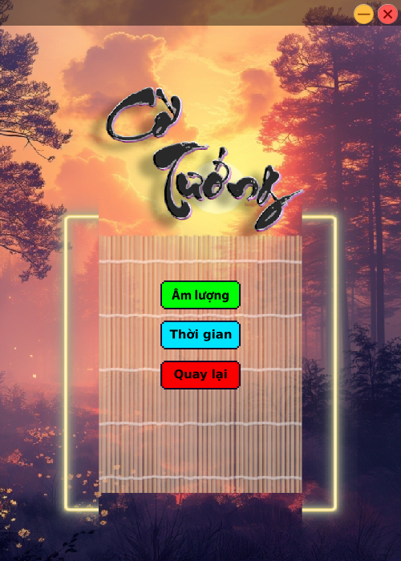
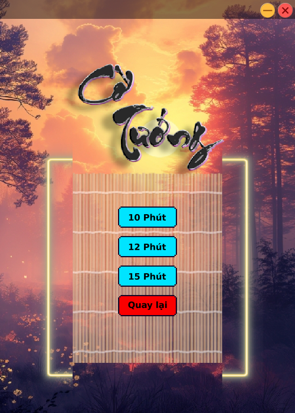
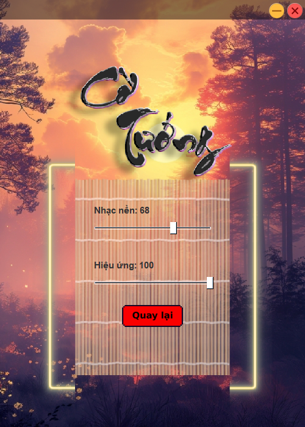
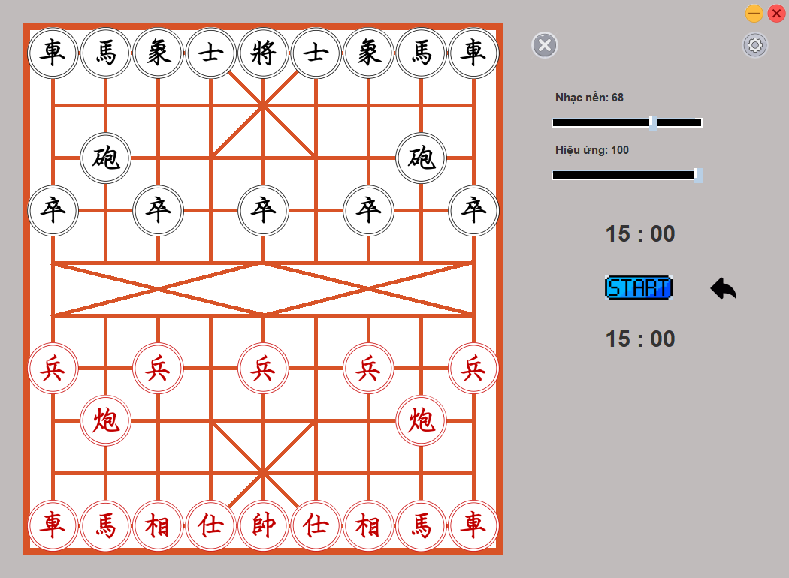
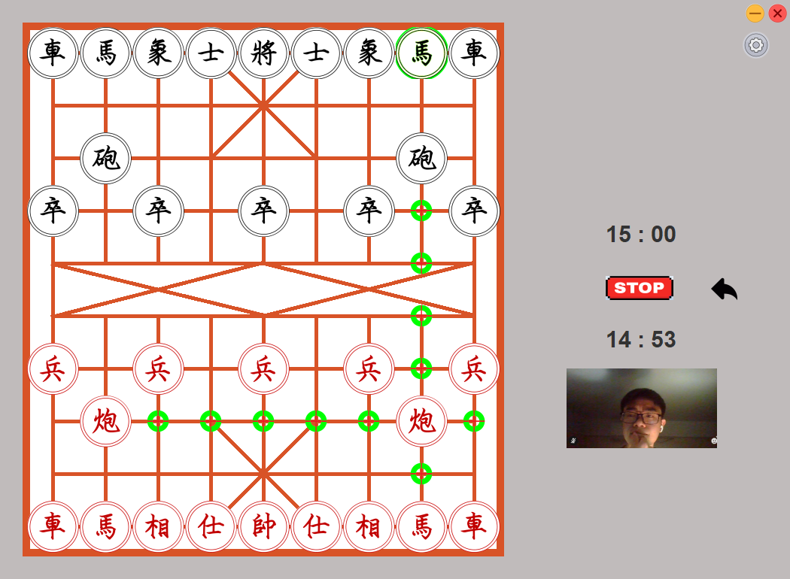

# Chinese Chess - Cờ Tướng

### Overview
**Chinese Chess (Cờ Tướng)** is a traditional two-player strategy board game originating from China. This project provides a digital version of the game, featuring an intuitive interface and multiple customization options for an enhanced competitive experience.

### Features
1. **Main Interface**  
   A user-friendly layout to navigate the game’s features and modes.  
   

2. **Settings**  
   Allows players to adjust game configurations such as time limits, sound preferences, and gameplay settings.  
   

3. **Time Control**  
   Introduces adjustable time limits to add excitement and a competitive edge.  
   

4. **Sound Effects**  
   Customize sound settings for a more immersive experience during gameplay.  
   

5. **Game Modes**  
   Designed specifically for two players, offering a variety of modes to cater to different play styles and competitive levels.  
   

6. **Adjustments**  
   Provides flexible options to fine-tune the game environment, ensuring accessibility and enjoyment for both players.  
   

7. **Gameplay**  
   Enjoy dynamic and responsive gameplay, enabling smooth interactions between two players.  
   

### How to Play
- The game is played between two players: **Red** and **Black**.
- Players take turns to move their pieces according to the rules of Chinese Chess.
- The objective is to checkmate the opponent's general (king).

### License
This project is licensed under the [MIT License](LICENSE).  
You are free to use, modify, and distribute this software under the terms of the license.

